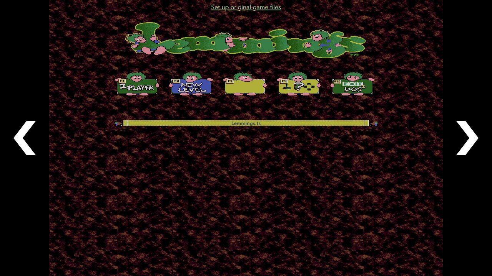
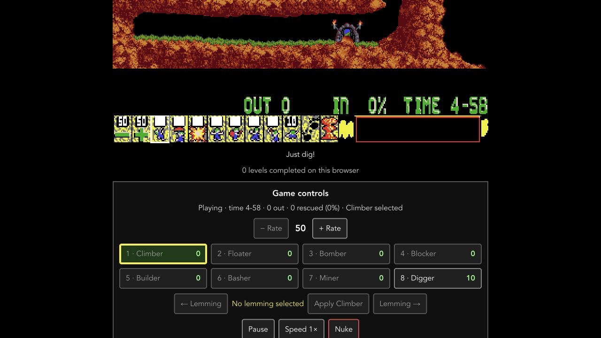
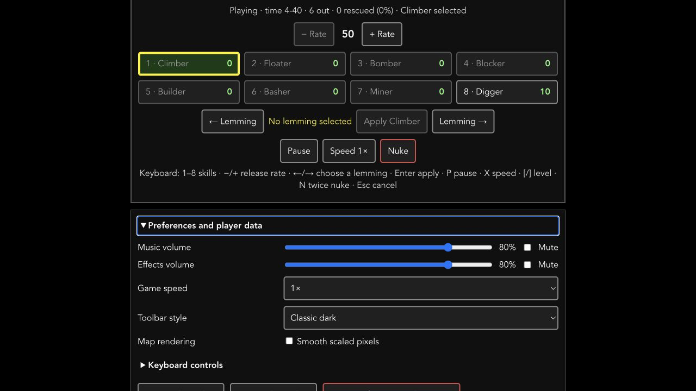

# Lemmings.ts
A Web Lemmings Clone/Remake in TypeScript - 🎉 Yes it's 100% JavaScript 🎉

<a href="http://lemmings.hmilch.net/">[play the game]</a>

## Feature
* Browser Game
* Support all variants of Lemmings Game
* Read original Lemmings binaries on the fly
* Support playing of original music by interpreting the adlib.dat file and using an Adlib emulator(s) (DosBox)

## ToDo
* fix some game issues
* touch support

## How to run
* download the *Lemmings.ts.zip* from [releases](https://github.com/tomsoftware/Lemmings.ts/releases)
* copy the original *Lemmings*, *OhNo* and *Holiday* binaries into the directory **run/{version}/**
* start *lemmings.html* - because of security restrictions you may need to call the lemmings.html via a webserver e.g. [nginx](https://www.nginx.com/)

## How to compile
The project uses Vue 3, TypeScript, and Vite. The framework-independent game source is in `src/game`.

* install [Node.js](https://nodejs.org/en/download/) 20.19 or newer
* run `npm install` to install dependencies
* run `npm run build` to type-check and build the game into `dist/`

## How to develop
* run `npm install`
* run `npm run dev` to start the development server
* run `npm test` for unit tests
* run `npm run lint` for static analysis
* run `npm run check` to reproduce the complete required CI validation locally

The regression suite uses only project-authored synthetic data. See [docu/TESTING.md](docu/TESTING.md) for its fixture conventions and how to add parser, gameplay, terrain, or replay cases.

Mouse, touch, pen, and keyboard controls are documented in [docu/CONTROLS.md](docu/CONTROLS.md). The game includes a semantic toolbar with readable skill names and counts in addition to the classic canvas panel.

Preferences and completed-level progress are saved locally in the browser and
can be exported or reset from the game screen. See
[docu/PLAYER-DATA.md](docu/PLAYER-DATA.md) for the saved fields, recovery rules,
and privacy details.

### How to debug using *Visual Studio Code*
* install [Visual Studio Code](https://code.visualstudio.com/)
* open project folder (root folder of the project) in *Visual Studio Code*
* press *Ctrl+Shift+B* to start the development server
* use *F5* to run the debugger

The original DOS game data is not distributed with this repository. Copy your legally obtained files into the corresponding `public/data/<version>/` directory before launching the game.

Distribution boundaries, release checks, and the current private-repository
policy are documented in [docu/DISTRIBUTION.md](docu/DISTRIBUTION.md). Dependency
licenses are inventoried from the lockfile in
[docu/DEPENDENCY-LICENSES.md](docu/DEPENDENCY-LICENSES.md), and tracked visual
assets are recorded in [docu/ASSET-PROVENANCE.md](docu/ASSET-PROVENANCE.md).
Automated checks, dependency updates, branch protection, and private release
steps are documented in [docu/CI-AND-RELEASES.md](docu/CI-AND-RELEASES.md).

See [docu/MODERNIZATION.md](docu/MODERNIZATION.md) for the 2026 modernization audit and recommended next work. The toolbar can be exported, edited as a high-resolution PNG, and loaded without repacking the DOS data; see [docu/TOOLBAR-ARTWORK.md](docu/TOOLBAR-ARTWORK.md).

## State

# Licensing and game ownership

Original project code is available under the MIT terms in `LICENSE`. The
DOSBox-derived DBOPL audio emulator has separate GPL-2.0-or-later terms; see
`THIRD_PARTY_NOTICES.md`. The project is not affiliated with or endorsed by the
owners of Lemmings. Its code license grants no rights to the Lemmings name,
characters, artwork, audio, levels, or original data files. There is no
"abandonware" exception: players must provide data from a copy they are legally
entitled to use.

## Standing on the shoulders of giants
Special thanks goes to:
- DMA for the original game
- Volker Oth, ccexplore and Mindless for their work on reverse engineering the Lemmings Level and Grafic Formats
- DosBox for there OPL emulator
