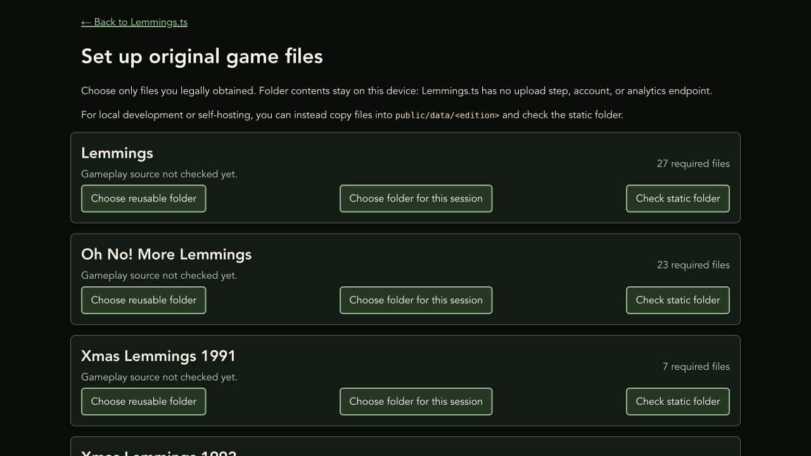

# Lemmings.ts

A browser-based TypeScript remake that reads legally obtained original DOS
Lemmings data files locally.

The original [public demo](https://lemmings.hmilch.net/) remains online, but it
may not include the modernization work in this private repository.

## Features

- Plays six supported DOS editions: Lemmings, Oh No! More Lemmings, Xmas
  Lemmings 1991 and 1992, and Holiday Lemmings 1993 and 1994.
- Reads the original level, graphics, sound, and music containers in the
  browser. Player-selected files are not uploaded.
- Recreates AdLib music with the DOSBox-derived DBOPL emulator running in an
  AudioWorklet.
- Supports mouse, trackpad, touch, pen, and configurable keyboard controls.
- Adds a readable semantic toolbar alongside the classic pixel-art panel.
- Saves preferences and completed-level progress locally, with export and
  reset controls.

## Run locally

### Requirements

- Node.js 24 LTS or a newer supported release
- A current browser within the production target: Chrome or Edge 111+,
  Firefox 114+, or Safari/iOS 16.4+
- Legally obtained data files from a supported DOS edition

Node.js is needed only to develop or build the project. A built copy is a
static browser application and does not require a Node server.

```sh
npm ci
npm run dev
```

Open `http://localhost:5173`, select **Set up original game files**, and choose
an edition folder from your device. The setup screen validates filenames and
containers before play. It can also check self-hosted files copied under
`public/data/<edition>/`.

See [Original game-data setup](docu/GAME-DATA-SETUP.md) for supported folders,
browser fallbacks, privacy details, and the manual-copy layout.

## Controls

- Click or tap a lemming to apply the selected skill.
- Drag the game area to move around the level.
- Use the named toolbar or keyboard shortcuts for skills, release rate, pause,
  speed, level navigation, and Nuke.
- Mouse-wheel and trackpad-pinch zoom are disabled over the game canvas to keep
  the play area stable. Browser zoom remains available with Command/Ctrl `+`
  and `-`, or through the browser menu.

The full keyboard map, pointer behaviour, remapping, and accessibility notes
are in [Controls and accessibility](docu/CONTROLS.md).

## Build and verify

```sh
npm run build
npm run preview
```

The production build is written to `dist/`. It deliberately excludes original
DOS files and locally edited toolbar artwork.

Useful development commands:

```sh
npm test          # unit and synthetic regression tests
npm run lint      # static analysis
npm run typecheck # TypeScript and Vue checks
npm run check     # complete CI and release validation
```

The regression suite uses project-authored synthetic data only. See
[Testing](docu/TESTING.md) for fixture conventions and manual browser/audio
checks.

### Visual Studio Code

Open the repository folder and run **Tasks: Run Build Task** to start the
development server. The included launch configuration starts Chrome at
`http://localhost:5173`; use **Run and Debug** or F5 after the server is ready.

## Project documentation

- [Modernization status](docu/MODERNIZATION.md)
- [Toolbar artwork workflow](docu/TOOLBAR-ARTWORK.md)
- [Player data and privacy](docu/PLAYER-DATA.md)
- [Distribution and licensing](docu/DISTRIBUTION.md)
- [Automated checks and private releases](docu/CI-AND-RELEASES.md)
- [Dependency licenses](docu/DEPENDENCY-LICENSES.md)
- [Asset provenance](docu/ASSET-PROVENANCE.md)

The framework-independent game engine is under `src/game`; Vue 3 provides the
browser interface and Vite provides development and production builds.

## Current interface




## Licensing and game ownership

The original project code is available under the MIT terms in `LICENSE`. The
DOSBox-derived DBOPL audio emulator has separate GPL-2.0-or-later terms; see
`THIRD_PARTY_NOTICES.md`.

This project is not affiliated with or endorsed by the owners of Lemmings. Its
code licenses grant no rights to the Lemmings name, characters, artwork, audio,
levels, or original data files. Players must provide data from a copy they are
legally entitled to use.

## Acknowledgements

- DMA Design for the original game
- Volker Oth, ccexplore, and Mindless for reverse-engineering documentation of
  the Lemmings level and graphics formats
- The DOSBox team for the OPL emulator
